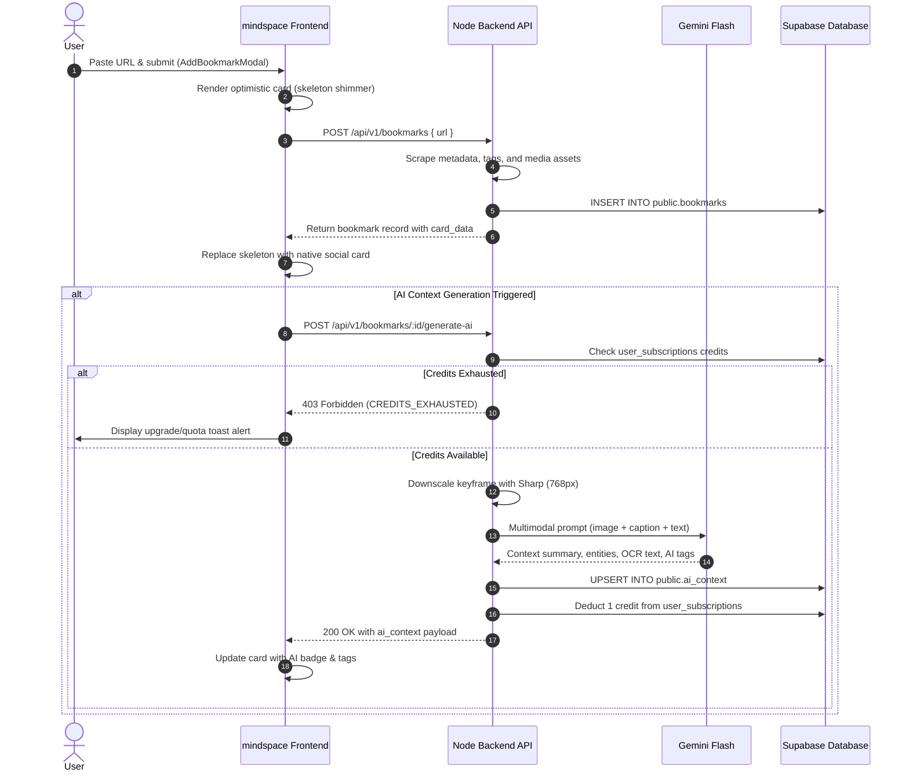
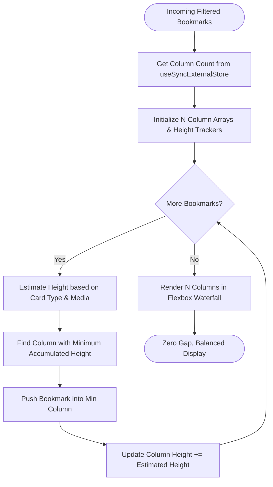
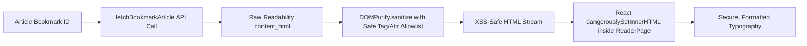

# Mindspace Frontend — Comprehensive Technical Documentation (`DETAILS.md`)

A modern, responsive, high-performance web media and social bookmark curator built with **React 19**, **TypeScript**, **Vite 8**, **Tailwind CSS v4**, **Liquid Glass**, and **Supabase**.

Mindspace transforms URLs from major social networks (Twitter / X, Instagram, LinkedIn, Reddit, YouTube, Facebook) and arbitrary web pages into rich, platform-native interactive cards. Bookmarks are enhanced with automated metadata extraction, safe image caching and proxy fallbacks, distraction-free **Reader Mode**, and token-efficient **Multimodal Gemini AI** visual intelligence.

---

## Table of Contents

1. [Architecture & System Overview](#architecture--system-overview)
2. [Design System & Aesthetics](#design-system--aesthetics)
3. [Complete Implementation History](#complete-implementation-history)
   - [1. Authentication, Sessions & Token Security](#1-authentication-sessions--token-security)
   - [2. Platform-Native Social Cards UI](#2-platform-native-social-cards-ui)
   - [3. Distraction-Free Reader Mode with DOMPurify XSS Sanitization](#3-distraction-free-reader-mode-with-dompurify-xss-sanitization)
   - [4. Automated Multimodal AI Pipeline & Credit Gating](#4-automated-multimodal-ai-pipeline--credit-gating)
   - [5. Waterfall Masonry Layout & 120 FPS Search](#5-waterfall-masonry-layout--120-fps-search)
   - [6. Media Reliability, Proxy Fallback & In-Memory Cache](#6-media-reliability-proxy-fallback--in-memory-cache)
   - [7. Security Audit & Client Hardening Controls](#7-security-audit--client-hardening-controls)
   - [8. SEO & Social Metadata Architecture](#8-seo--social-metadata-architecture)
   - [9. Codebase Optimization & Quality Auditing (Zero Bloat)](#9-codebase-optimization--quality-auditing-zero-bloat)
4. [Mermaid Architecture & Data Flow Diagrams](#mermaid-architecture--data-flow-diagrams)
   - [System Topology & Infrastructure](#system-topology--infrastructure)
   - [Bookmark Creation & Multimodal AI Sequence](#bookmark-creation--multimodal-ai-sequence)
   - [Waterfall Masonry Greedy Distribution Flow](#waterfall-masonry-greedy-distribution-flow)
   - [Reader Mode Content Sanitization Pipeline](#reader-mode-content-sanitization-pipeline)
5. [Component & Directory Structure](#component--directory-structure)
6. [API Client Specifications](#api-client-specifications)
7. [Environment Variables](#environment-variables)
8. [Getting Started & Verification](#getting-started--verification)

---

## Architecture & System Overview

Mindspace employs a decoupled, secure **client-service architecture**:

- **Frontend (`mindspace-frontend`)**:
  - **Core Framework**: React 19 + TypeScript + Vite 8.
  - **Styling**: Tailwind CSS v4 with custom Vanilla CSS Design Tokens (`src/index.css`) featuring the *Sand Dune* palette, glassmorphism (`@samasante/liquid-glass`), and dark/light View Transitions.
  - **State & Rendering**: React 18/19 Concurrent primitives (`useDeferredValue`), `useSyncExternalStore` for resize tracking, memoized components (`React.memo`), callback stabilization (`useCallback`), and session-level in-memory media caching.
  - **Data Access**: Pure REST integration through a typed API client (`src/services/api.ts`) communicating with the Node.js backend. No direct database secrets or queries run on the client.
- **Backend Service (`mindspace-node-backend`)**:
  - **Platform Scrapers & Extractors**: Cheerio, Playwright, and social metadata parsers for Twitter, Instagram, LinkedIn, Reddit, YouTube, Facebook, and generic web articles.
  - **AI Visual Intelligence**: Google Gemini 2.5 / 3.x Flash (`@google/genai`) for multimodal vision analysis, entity extraction, OCR transcription, and contextual tagging.
  - **Image Proxy**: Streaming reverse image proxy (`/api/v1/proxy-image?url=...`) resolving hotlink-blocked CDN assets (Meta, Reddit, Twitter).
  - **Database & Auth Integration**: Supabase PostgreSQL tables (`bookmarks`, `articles`, `ai_context`, `user_subscriptions`, `user_settings`) protected by Row Level Security (RLS) and bearer token authentication.

---

## Design System & Aesthetics

Mindspace delivers a tactile, liquid-glass aesthetic inspired by modern macOS interfaces and warm desert sand dunes:

- **Liquid Glass Container**: Interactive refractions and specular highlights powered by `@samasante/liquid-glass`, rendering glassmorphic cards and floating HUD elements with backdrop blur filters.
- **Sand Dune Color Palette**:
  - Light Mode: Warm cream backgrounds (`#fbf8f3`, `#f5f0e6`), soft sand borders (`#e8decb`), crisp high-contrast headings (`#2d261e`), and terracotta accents (`#c06c46`).
  - Dark Mode: Deep obsidian tones (`#121110`, `#1a1816`), warm charcoal surfaces (`#24211e`), muted amber borders (`#38332c`), and glowing dune highlights (`#d97745`).
- **Animated View Transitions**: Full-page, circular ripple theme toggles using the native Web View Transitions API (`document.startViewTransition`) and `AnimatedThemeToggler.tsx`.
- **Micro-Interactions**: Smooth hover elevations, spring-based scale transitions, and responsive carousel navigation.

---

## Complete Implementation History

### 1. Authentication, Sessions & Token Security
- **Supabase Auth Gateway (`src/App.tsx`, `src/components/AuthPage.tsx`, `src/lib/supabase.ts`)**:
  - Secure email/password authentication and sign-up with real-time field validation.
  - **Password Complexity**: Enforces `PASSWORD_REGEX = /^(?=.*[a-z])(?=.*[A-Z])(?=.*\d).{8,}$/` (at least 8 characters with lowercase, uppercase, and digit) before submitting credentials.
  - **Token Refresh & Stampede Prevention (`src/services/api.ts`)**:
    - Automatic token refresh on 401 Unauthorized responses.
    - Synchronized via a single global `refreshPromise` so concurrent API calls share the same refresh attempt without race conditions.
  - **Account Enumeration Protection**: Forgot-password flow displays generic confirmation regardless of email existence.
  - Session persistence and hydration via `supabase.auth.getSession()` and live synchronization across browser tabs via `supabase.auth.onAuthStateChange()`.
  - Protected routing:
    - `/`: Interactive 3D/scrolling Landing Page (`LandingPage.tsx`).
    - `/auth`: Glassmorphic authentication terminal.
    - `/my/app`: Authenticated curator dashboard; unauthorized visitors are redirected to `/auth`.
    - `/article/:articleId`: Protected distraction-free reader mode viewer.

### 2. Platform-Native Social Cards UI
Every supported social platform renders as an authentic, platform-native card rather than a generic box:

| Platform | Component | Features Implemented |
| :--- | :--- | :--- |
| **Twitter / X** | `TwitterCard.tsx` | Native typography, verified badges, author avatar, formatted tweet text, multi-image carousels, reply/repost/like/view metrics, and X branding. |
| **Instagram** | `InstagramCard.tsx` | Instagram profile header, multi-aspect-ratio image carousels with dot pagination, expandable caption parser, like and comment counters. |
| **LinkedIn** | `LinkedInCard.tsx` | Authentic multi-reaction badges (Like, Celebrate, Support, Insightful), author headline, multi-image collage grid with `+N` overflow badge, comments and reposts. |
| **Reddit** | `RedditCard.tsx` | Subreddit alien avatar, `r/community` name, author username, upvote/downvote action badges, comment count, self-text preview, and image/video embed display. |
| **YouTube** | `YouTubeCard.tsx` | Embedded video player / high-res thumbnail viewer, channel avatar, subscriber and view count formatters, and YouTube branding. |
| **Facebook** | `FacebookCard.tsx` | Facebook blue reaction badge, author avatar, post timestamp, likes/comments/shares counters, and multi-media support. |
| **Generic Web** | `GenericCard.tsx` | Universal fallback for blogs and articles: domain badge, Google S2 high-res favicon, snapshot preview, article title, and summary. |

### 3. Distraction-Free Reader Mode with DOMPurify XSS Sanitization
- **Reader View Component (`src/components/ReaderPage.tsx`)**:
  - Full-page distraction-free reading experience for saved web articles.
  - Theme customization: Warm (sepia), Dark, and Light modes.
  - Font size controls: `sm`, `base`, `lg`, and `xl`.
  - Live reading progress indicator tracking scroll percentage.
  - Word count, estimated reading time, and domain attribution.
- **XSS Sanitization Guard**:
  - Third-party web article HTML extracted by Mozilla Readability can contain malicious payloads (``, `<svg onload>`, injected CSS).
  - Sanitized via `DOMPurify.sanitize(article.content_html, { ADD_ATTR: ['target', 'rel'] })` before rendering through `dangerouslySetInnerHTML`.
  - Guarantees zero script execution in the authenticated user's session.

### 4. Automated Multimodal AI Pipeline & Credit Gating
- **Multimodal Visual Intelligence (Gemini 2.5 / 3.x Flash)**:
  - Ingestion of web page hero images, video posters, and keyframes.
  - Summarizes deep contextual takeaways, detects salient visual entities, transcribes embedded OCR text, and assigns categorizing AI tags.
- **Credit Quota & Tier Gating**:
  - Free users receive monthly credit allocations; Pro users receive expanded/unlimited allocations.
  - Frontend intercepts 403 `CREDITS_EXHAUSTED` responses via `CreditExhaustedError`, rendering upgrade toasts and disabling duplicate triggers.
- **Glassmorphic AI Context Modal (`AiContextModal.tsx`)**:
  - Displays generated summaries, interactive pill tags, detected visual entities, and raw OCR transcription with one-click clipboard copying.

### 5. Waterfall Masonry Layout & 120 FPS Search
- **True Greedy Waterfall Distribution (`src/templates/bookmarks.tsx`)**:
  - Eliminates awkward gaps and unbalanced columns caused by pure CSS column-count.
  - Greedy algorithm: each bookmark is assigned to the column with the least accumulated visual height.
  - Responsive column counts (`1` for mobile, `2` for tablet, `3` for laptop, `4` for desktop) dynamically monitored via `useSyncExternalStore`.
- **Concurrent React 19 Search**:
  - Search queries filtered via `useDeferredValue(rawSearchTerm)` to keep input typing at **120 FPS** without UI freezing.
  - Instant fuzzy matching across title, description, URL, domain, platform, and author.

### 6. Media Reliability, Proxy Fallback & In-Memory Cache
- **In-Memory Image Session Cache (`SafeImage.tsx`)**:
  - Global `Set` tracks loaded image URLs across mounts; subsequent views display immediately at `opacity-100` with zero layout shift (CLS).
- **Automated Proxy Fallback**:
  - Intercepts 403 Forbidden / CORS errors caused by anti-hotlinking CDN protections (Instagram/Meta CDNs, Reddit i.redd.it).
  - Automatically reroutes image requests through `/api/v1/proxy-image?url=...` with authentication.
- **Strict URL Sanitization (`src/lib/utils.ts`)**:
  - Validates URLs and blocks dangerous schemes (`javascript:`, `vbscript:`, `data:`, `file:`).

### 7. Security Audit & Client Hardening Controls
Comprehensive client-side security measures implemented during the audit:

| Control | File | Threat Mitigated | Implementation |
|---|---|---|---|
| **DOMPurify Sanitization** | `src/components/ReaderPage.tsx` | Stored XSS via third-party extracted HTML | `DOMPurify.sanitize(article.content_html)` wraps all reader mode innerHTML rendering |
| **Password Complexity Regex** | `src/components/AuthPage.tsx` | Weak credentials / credential stuffing | Minimum 8 chars, 1 uppercase, 1 lowercase, 1 digit enforced on signup |
| **Content-Security-Policy (CSP)** | `index.html` | Cross-site scripting, rogue script injection, unauthorized connections | Restricted `default-src 'self'`, `script-src`, `connect-src` (Supabase, Render backend), `style-src` (Google Fonts), `frame-src` |
| **No-Referrer Policy** | `index.html` | Privacy leakage of bookmark URLs | `<meta name="referrer" content="no-referrer">` prevents URL leakage in HTTP headers |
| **Token Stampede Protection** | `src/services/api.ts` | Race conditions in JWT refresh | Single active `refreshPromise` coordinates all concurrent requests |
| **Image Proxy Auth Interception** | `src/components/SocialCards/SafeImage.tsx` | Unauthorized proxy relay abuse | Passes user JWT when requesting fallback image streams |

### 8. SEO & Social Metadata Architecture
- Dynamic and primary Open Graph, Twitter Cards, and canonical meta tags in `index.html`.
- JSON-LD structured data (`schema.org/WebApplication`) providing rich snippets for search engines.
- `Vercel.json` SPA rewrite rules and fallback API URL handling.

### 9. Codebase Optimization & Quality Auditing (Zero Bloat)
- **Dead Code Eradication**: Removed unreferenced legacy files (`SocialCardWrapper.tsx`, `BottomNavbar.tsx`, `GlassCursor.tsx`).
- **Standardized Type Safety**: Fully typed models in `src/types/bookmark.ts`; zero `any` casts in core application paths.
- **Rollup Chunk Splitting (`vite.config.ts`)**: Isolated vendor chunks (`vendor-three`, `vendor-glass`, `vendor-motion`, `vendor-icons`, `vendor-react`), cutting initial bundle load times.
- **Strict Verification**: **0 ESLint errors** and **0 TypeScript compile errors** (`tsc -b`).

---

## Mermaid Architecture & Data Flow Diagrams

### System Topology & Infrastructure

```mermaid
graph TB
    subgraph Client ["Client Layer (mindspace-frontend)"]
        UI[React 19 Dashboard & Social Cards]
        Reader[ReaderPage & DOMPurify Sanitizer]
        State[Waterfall Masonry & Deferred Search]
        Cache[SafeImage In-Memory Cache]
        APIClient[Typed REST Client (services/api.ts)]
    end

    subgraph Backend ["Service Layer (mindspace-node-backend)"]
        Router[Express API Gateway /api/v1]
        Scraper[Cheerio & Playwright Scrapers]
        ImgProxy[Streaming Reverse Image Proxy with Auth]
        Gemini[Google Gemini Vision API]
        Quota[Credit & Quota Engine]
    end

    subgraph SupabaseDB ["Persistence Layer (Supabase PostgreSQL)"]
        Auth[Supabase Auth / JWT]
        T_Bookmarks[(public.bookmarks)]
        T_Articles[(public.articles)]
        T_AI[(public.ai_context)]
        T_Subs[(public.user_subscriptions)]
    end

    UI --> State
    UI --> Cache
    UI --> APIClient
    Reader --> APIClient
    APIClient -- Bearer JWT --> Router
    Router --> Quota
    Router --> Scraper
    Router --> Gemini
    Router --> ImgProxy
    Router -- Service Role / RLS --> T_Bookmarks
    Router -- 1:1 Articles --> T_Articles
    Router -- 1:1 Cascade --> T_AI
    Quota --> T_Subs
    Cache -. 403 Fallback + JWT .-> ImgProxy
```

### Bookmark Creation & Multimodal AI Sequence



### Waterfall Masonry Greedy Distribution Flow



### Reader Mode Content Sanitization Pipeline



---

## Component & Directory Structure

```
mindspace-frontend/
├── src/
│   ├── components/
│   │   ├── SocialCards/
│   │   │   ├── CarouselNavButtons.tsx   # Left/right carousel navigation arrows
│   │   │   ├── ExpandableText.tsx       # Smooth collapsible caption expander
│   │   │   ├── FacebookCard.tsx         # Platform-native Facebook post card
│   │   │   ├── GenericCard.tsx          # General website bookmark card with Google S2 favicon
│   │   │   ├── InstagramCard.tsx        # Platform-native Instagram post & reel card
│   │   │   ├── LinkedInCard.tsx         # Platform-native LinkedIn card with reaction badges
│   │   │   ├── RedditCard.tsx           # Platform-native Reddit post card with vote counters
│   │   │   ├── SafeImage.tsx            # Cached image loader with auto proxy fallback
│   │   │   ├── SocialCardIcons.tsx      # SVG icon assets for all platforms & actions
│   │   │   ├── TwitterCard.tsx          # Platform-native Twitter / X card
│   │   │   └── YouTubeCard.tsx          # Platform-native YouTube player/thumbnail card
│   │   ├── ui/
│   │   │   ├── AnimatedThemeToggler.tsx # View-transition dark/light theme switcher
│   │   │   ├── ContainerScroll.tsx      # Smooth 3D scroll container for landing showcases
│   │   │   ├── DashboardWireframe.tsx   # Visual wireframe preview of curator dashboard
│   │   │   ├── FeatureBento.tsx         # Bento-grid feature highlights
│   │   │   ├── InteractiveStory.tsx     # Step-by-step interactive product narrative
│   │   │   └── ScreenSkeleton.tsx       # Shimmering skeleton loader for initial data load
│   │   ├── AddBookmarkModal.tsx         # Modal dialog for submitting new URLs
│   │   ├── AiContextModal.tsx           # Multimodal AI Context, Tags, Entities & OCR modal
│   │   ├── AuthPage.tsx                 # Supabase authentication terminal with password complexity
│   │   ├── BookmarkCard.tsx             # Card dispatcher routing to specific social card
│   │   ├── DeleteConfirmModal.tsx       # Confirmation dialog for bookmark removal
│   │   ├── LandingPage.tsx              # Public interactive landing page
│   │   └── ReaderPage.tsx               # Full-page Reader Mode with DOMPurify XSS sanitization
│   ├── Layout/
│   │   └── DashboardLayout.tsx          # Shell: header, search, filters, toast notifications
│   ├── lib/
│   │   ├── supabase.ts                  # Supabase client initialization
│   │   └── utils.ts                     # Single source of truth for formatters and sanitizers
│   ├── services/
│   │   └── api.ts                       # Typed REST client with token refresh & stampede prevention
│   ├── templates/
│   │   ├── bookmarks.tsx                # Dynamic greedy waterfall masonry grid & platform tabs
│   │   └── nav.tsx                      # Top search bar and user profile controls
│   ├── types/
│   │   └── bookmark.ts                  # TypeScript interfaces for bookmarks, AI context, and card data
│   ├── App.tsx                          # Root router & auth session lifecycle provider
│   ├── index.css                        # Tailwind CSS v4 directives & Sand Dune design tokens
│   └── main.tsx                         # Vite application entry point
├── index.html                           # HTML5 template with Content-Security-Policy & SEO meta tags
├── package.json                         # Dependencies including dompurify, framer-motion, liquid-glass
└── vite.config.ts                       # Vite configuration with chunk splitting & Tailwind v4
```

---

## API Client Specifications

All network interactions pass through `src/services/api.ts`:

- `fetchBookmarks()`: Retrieves all bookmarks for the authenticated user, joined with AI context.
- `createBookmark({ url })`: Initiates URL scraping, metadata extraction, and storage.
- `triggerGenerateAi(bookmarkId)`: Requests server-side multimodal vision analysis. Throws `CreditExhaustedError` on 403 quota exhaustion.
- `deleteBookmark(bookmarkId)`: Removes bookmark and cascades deletion.
- `updateBookmarkMetadata(bookmarkId, data)`: Edits title, description, or custom notes.
- `fetchBookmarkArticle(bookmarkId)`: Retrieves full reader-mode article content for `ReaderPage`.
- `getUserPlan()`: Retrieves current subscription tier (`free` / `pro`) and remaining AI credits.
- `signUpUser(email, password, username)`: Registers user with password validation.
- `signInUser(email, password)`: Logs in and initializes session tokens.
- `sendPasswordResetEmail(email)`: Triggers password reset flow.

---

## Environment Variables

Create a `.env` file in `mindspace-frontend/`:

```env
# Supabase Configuration
VITE_SUPABASE_URL=https://your-project.supabase.co
VITE_SUPABASE_ANON_KEY=your-anon-key-here

# mindspace Node Backend URL
VITE_API_URL=http://localhost:3000/api/v1
```

---

## Getting Started & Verification

### Installation
```bash
npm install
```

### Local Development
```bash
npm run dev
```

### Type Checking & Build
```bash
npx tsc --noEmit
npm run build
```
