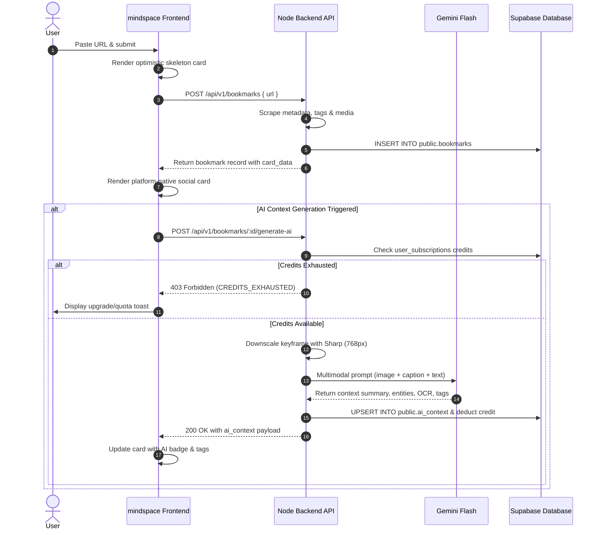
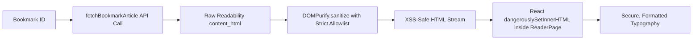

# Mindspace Frontend (`mindspace-frontend`)

> **High-performance, liquid-glass visual media vault & social bookmark curator built with React 19, TypeScript, Vite 8, Tailwind CSS v4, and Supabase.**

Mindspace transforms URLs from Twitter/X, Instagram, LinkedIn, Reddit, YouTube, Facebook, and web articles into rich, interactive, platform-native cards with automated metadata extraction, distraction-free **Reader Mode**, and token-efficient **Multimodal Gemini AI** visual intelligence.

> [!NOTE]
> **Complete Technical Documentation**: For exhaustive architectural specifications, full implementation history, API client definitions, and directory breakdowns, see [**`DETAILS.md`**](./DETAILS.md).

---

## 🚀 Key Features

* **Platform-Native Social Cards**: Authentic cards for Twitter/X, Instagram, LinkedIn, Reddit, YouTube, Facebook, and generic web articles with native branding, metric counters, and media carousels.
* **Distraction-Free Reader Mode**: Clean, readable typography viewer for articles with warm/dark/light themes, dynamic font sizing, reading progress bar, and estimated reading time.
* **Multimodal AI Visual Intelligence**: Instant visual summarization, OCR text transcription, entity detection, and contextual AI tags powered by Google Gemini 2.5 / 3.x Flash.
* **True Greedy Waterfall Masonry**: Zero-gap, dynamic column masonry layout (`1` to `4` columns) balanced by accumulated card heights via `useSyncExternalStore`.
* **120 FPS Concurrent Search**: Ultra-responsive instant search across titles, descriptions, authors, and domains powered by React 19 `useDeferredValue`.
* **Resilient Media Pipeline**: In-memory session image caching preventing layout shifts (CLS) with automated fallback to the authenticated backend image proxy.
* **Liquid Glass Design System**: Sand Dune aesthetic, backdrop blur refractions, tactile micro-interactions, and circular ripple View Transitions.

---

## 📊 Workflow & Architecture Diagrams

### 1. System Topology & Infrastructure
```mermaid
graph TB
    subgraph Client ["Client Layer (mindspace-frontend)"]
        UI[React 19 Dashboard & Social Cards]
        Reader[ReaderPage & DOMPurify Sanitizer]
        State[Waterfall Masonry & Deferred Search]
        Cache[SafeImage In-Memory Cache]
        APIClient[Typed REST Client (services/api.ts)]
    end

    subgraph Backend ["Service Layer (mindspace-node-backend)"]
        Router[Express API Gateway /api/v1]
        Scraper[Cheerio & Playwright Scrapers]
        ImgProxy[Streaming Reverse Image Proxy with Auth]
        Gemini[Google Gemini Vision API]
        Quota[Credit & Quota Engine]
    end

    subgraph SupabaseDB ["Persistence Layer (Supabase PostgreSQL)"]
        Auth[Supabase Auth / JWT]
        T_Bookmarks[(public.bookmarks)]
        T_Articles[(public.articles)]
        T_AI[(public.ai_context)]
        T_Subs[(public.user_subscriptions)]
    end

    UI --> State
    UI --> Cache
    UI --> APIClient
    Reader --> APIClient
    APIClient -- Bearer JWT --> Router
    Router --> Quota
    Router --> Scraper
    Router --> Gemini
    Router --> ImgProxy
    Router -- Service Role / RLS --> T_Bookmarks
    Router -- 1:1 Articles --> T_Articles
    Router -- 1:1 Cascade --> T_AI
    Quota --> T_Subs
    Cache -. 403 Fallback + JWT .-> ImgProxy
```

### 2. Bookmark Creation & Multimodal AI Sequence


### 3. Reader Mode Content Sanitization Pipeline


---

## 🛡️ Security Checks & Hardening Controls

The following client-side security measures have been audited and implemented:

| Category | Security Control | Threat / Vulnerability Mitigated | Implementation Detail | Status |
|---|---|---|---|:---:|
| **XSS Prevention** | **DOMPurify Sanitization** | Stored XSS via third-party extracted HTML | `DOMPurify.sanitize(article.content_html)` wraps all reader mode HTML rendering in `ReaderPage.tsx` | ✅ **Active** |
| **Authentication** | **Password Complexity Validation** | Weak credentials & credential stuffing | Enforces `PASSWORD_REGEX` (minimum 8 chars, 1 uppercase, 1 lowercase, 1 digit) on signup in `AuthPage.tsx` | ✅ **Active** |
| **Content Security** | **Content-Security-Policy (CSP)** | Cross-site scripting, clickjacking, rogue script injection | Strict `<meta>` tag in `index.html` restricting `default-src 'self'`, `script-src`, `connect-src` (Supabase, Render backend), `style-src` (Google Fonts), `frame-src` | ✅ **Active** |
| **Session Integrity** | **Token Refresh Stampede Lock** | Race conditions & session loss during token renewal | Global `refreshPromise` synchronizes concurrent requests so only one refresh call executes at a time in `services/api.ts` | ✅ **Active** |
| **User Privacy** | **Strict Referrer Policy** | Sensitive URL / token leakage via HTTP Referer headers | `<meta name="referrer" content="no-referrer">` configured in `index.html` | ✅ **Active** |
| **Access Control** | **Authenticated Image Proxy Routing** | Unauthorized open-proxy relay abuse | `SafeImage.tsx` passes caller's JWT bearer token when falling back to `/api/v1/proxy-image` | ✅ **Active** |
| **Injection Defense** | **Protocol Sanitization** | Script execution via malicious protocol handlers | `src/lib/utils.ts` validates all external URLs, rejecting `javascript:`, `vbscript:`, `data:`, and `file:` URIs | ✅ **Active** |

---

## ⚡ Quick Start

```bash
# 1. Install dependencies
npm install

# 2. Start local development server
npm run dev

# 3. Type check & production build
npx tsc --noEmit
npm run build
```

For complete environment variable configuration and development details, please consult [**`DETAILS.md`**](./DETAILS.md).
