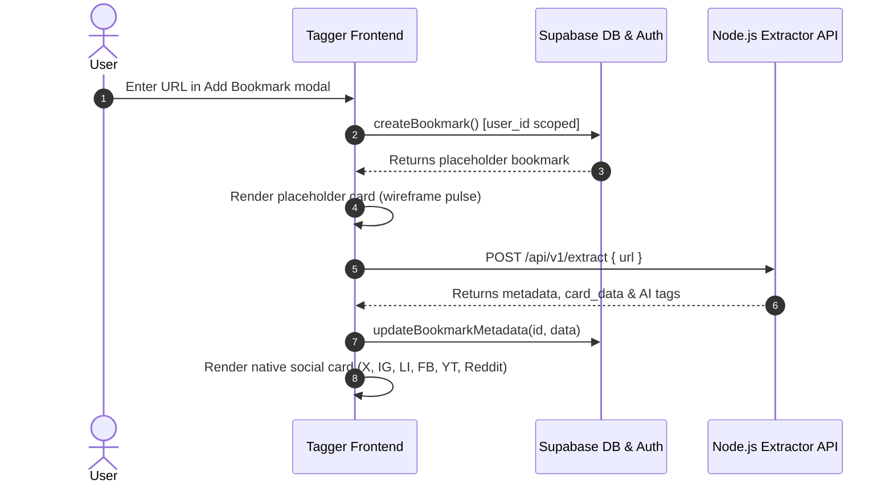

# Tagger Frontend (`tagger-frontend`)

A modern, responsive, high-performance social bookmark and web media curator built with **React 19**, **TypeScript**, **Vite**, **Tailwind CSS v4**, and **Supabase**.

Tagger transforms bookmarked links from major social networks and arbitrary websites into rich, platform-native cards with auto-extracted metadata, media galleries, expandable captions, engagement metrics, and multimodal AI visual context.

---

## Table of Contents

1. [Architecture & Design System](#architecture--design-system)
2. [What Has Been Done Until Now](#what-has-been-done-until-now)
   - [1. Authentication & Session Management](#1-authentication--session-management)
   - [2. Supabase Integration & CRUD Workflows](#2-supabase-integration--crud-workflows)
   - [3. Platform-Native Social Cards UI Overhaul](#3-platform-native-social-cards-ui-overhaul)
   - [4. Search Performance & Re-render Elimination](#4-search-performance--re-render-elimination)
   - [5. Media Handling & Safe Image Fallbacks](#5-media-handling--safe-image-fallbacks)
   - [6. Navigation, Layout & Ambient UX](#6-navigation-layout--ambient-ux)
3. [Component & Directory Structure](#component--directory-structure)
4. [API & Data Flow](#api--data-flow)
5. [Environment Variables](#environment-variables)
6. [Getting Started & Scripts](#getting-started--scripts)

---

## Architecture & Design System

- **Framework**: React 19 + TypeScript on Vite 8.
- **Styling**: Tailwind CSS v4 + Vanilla CSS Design Tokens (`src/index.css`) with curated light and dark modes, radial gradients, glassmorphism (`@liquidglass/react`), and backdrop filters.
- **State & Rendering**: React 18/19 Concurrent primitives (`useDeferredValue`), memoized components (`React.memo`), callback stabilization (`useCallback`), and session-level in-memory media caching.
- **Backend & Persistence**: Dual backend integration — Supabase for user auth and data storage; Stateless Node.js microservice (`tagger-node-backend`) for scraping, proxying, and AI visual intelligence.

---

## What Has Been Done Until Now

### 1. Authentication & Session Management
- **Full Supabase Auth (`src/App.tsx`, `src/components/AuthPage.tsx`, `src/lib/supabase.ts`)**:
  - Email and password sign-in and registration with validation and error states.
  - Automatic session recovery on page refresh via `supabase.auth.getSession()`.
  - Real-time auth subscription listener with `supabase.auth.onAuthStateChange()` to handle logins, logouts, and token refreshes seamlessly.
  - Protected routing:
    - `/`: Interactive Landing Page (`LandingPage.tsx`) showcasing product features and dynamic CTA ("Open App" vs. "Sign In").
    - `/auth`: Auth page with tabbed toggle between Sign In and Sign Up modes.
    - `/my/app`: Authenticated dashboard; automatically redirects unauthenticated users to `/auth`.

### 2. Supabase Integration & CRUD Workflows
- **User-Isolated Storage (`src/services/supabaseDataService.ts`)**:
  - All queries strictly enforce row-level tenant security by scoping to `userData.user.id`.
- **Optimistic Bookmark Creation**:
  - When a user adds a link via `AddBookmarkModal.tsx`, the card appears **immediately** in the UI with a lightweight wireframe skeleton state (`isFetchingMetadata: true`) while the backend extracts rich metadata in the background.
  - On metadata resolution, the bookmark is updated in Supabase and the card transitions to its full platform-specific view without requiring a page reload.
- **In-Place Metadata Updates**:
  - Modal editor (`EditBookmarkModal.tsx`) allowing users to edit bookmark titles and descriptions.
- **Safe Deletion**:
  - Modal confirmation (`DeleteConfirmModal.tsx`) with optimistic list removal and Supabase deletion.
- **Mac-Style Floating Glass HUD Notifications**:
  - Stackable bottom-center toast notification capsule (`DashboardLayout.tsx`) indicating async status (success, error, network alerts) with dismiss controls.

### 3. Platform-Native Social Cards UI Overhaul
Moved away from generic box layouts to pixel-perfect, native-resembling cards tailored to each social network:

| Platform | Component | Features Implemented |
| :--- | :--- | :--- |
| **Twitter / X** | `TwitterCard.tsx` | Platform dark/light styling, author avatar, verified badge, `@handle`, tweet text formatting, responsive media carousels, reply/repost/like/view metrics, and X brand logo. |
| **Instagram** | `InstagramCard.tsx` | Native Instagram aesthetic, author username and avatar, clean caption parser, multi-image carousel with navigation buttons & pagination dots, like and comment counters. |
| **LinkedIn** | `LinkedInCard.tsx` | Authentic official LinkedIn reaction badge (`LinkedInReactionBadge`), reactions, comments, and reposts counters, multi-image grid gallery with `+N` overflow badge, author headline, and bottom action bar. |
| **Reddit** | `RedditCard.tsx` | Subreddit alien avatar, `r/community` name, author username, upvote/downvote action badges, comment count, self-text preview, and image/video embed display. |
| **YouTube** | `YouTubeCard.tsx` | Video ID parser, interactive player/thumbnail viewer, channel avatar, subscriber/view counts, publication date, and YouTube branding. |
| **Facebook** | `FacebookCard.tsx` | Facebook blue reaction badge, author avatar, post timestamp, likes/comments/shares counters, and multi-media support. |
| **Generic Web** | `GenericCard.tsx` | Fallback card for general articles and blogs, showing domain badge, Google S2 high-res favicon, snapshot preview, article title, and description. |

#### Shared Card Subcomponents
- **`SafeImage.tsx`**: Advanced image loader that prevents blank flashes and automatically routes blocked images to the backend proxy.
- **`CarouselNavButtons.tsx`**: Left/right carousel control arrows for multi-image social posts.
- **`ExpandableText.tsx`**: Collapsible text container with animated "see more" / "see less" toggles for long posts.
- **`SocialCardIcons.tsx`**: Centralized, standalone SVG icon library covering verified badges, social logos, like icons, share actions, and reaction indicators.
- **`SocialCardWrapper.tsx`**: Unified card wrapper container providing dropdown action menus (Open original URL, Edit details, Delete bookmark).

### 4. Search Performance & Re-render Elimination
- **Single-Container Multi-Column Layout (`src/templates/bookmarks.tsx`)**:
  - Replaced legacy multi-column array slicing (`col_0`, `col_1`) with a responsive CSS multi-column container:
    ```tsx
    <div className="w-full columns-1 sm:columns-2 lg:columns-3 xl:columns-4 gap-4 [column-fill:_balance]">
    ```
  - Eliminates DOM node reparenting; cards maintain stable keys (`key={bookmark.id}`) and **never unmount or remount** while typing in search or filtering platforms.
- **Concurrent React 18 Search**:
  - Filter queries wrapped in `useDeferredValue(rawSearchTerm)` to keep input typing at **120 FPS** without UI freezing.
  - Multi-attribute search matching across bookmark title, description, domain, target URL, and timestamp.

### 5. Media Handling & Safe Image Fallbacks
- **Session Image Cache (`SafeImage.tsx`)**:
  - Module-level `globalLoadedImageUrls` set tracks loaded image URLs across mounts; subsequent views display immediately at `opacity-100` with zero fade-in delay or layout shifts.
- **Automatic Proxy Fallback**:
  - Detects CDN hotlink blocks or CORS failures (e.g. Meta/Facebook/Instagram 403 Forbidden) and reroutes the image to the backend image proxy (`/api/v1/proxy-image?url=...`).
  - Caches failing URLs in `proxyFallbackUrls` to bypass failing direct requests on future renders.
- **URL Sanitization (`src/lib/utils.ts`)**:
  - Strips ASCII control characters and blocks dangerous URL schemes (`javascript:`, `vbscript:`, `data:`, `file:`).

### 6. Navigation, Layout & Ambient UX
- **Top Glass Navigation Bar (`src/templates/nav.tsx`)**:
  - Dynamic scroll blur state (`isScrolled`), instant search bar with clear button, user profile indicator, and modal trigger.
- **Bottom Filter Bar (`src/components/ui/BottomNavbar.tsx`)**:
  - Floating dock with platform pills: **All**, **Twitter / X**, **Instagram**, **Facebook**, **LinkedIn**, **Reddit**.
- **Dark & Light Mode (`src/components/ui/AnimatedThemeToggler.tsx`)**:
  - Smooth animated theme toggling adhering to system preferences and saved localStorage states.
- **Skeleton Loaders (`src/components/ui/ScreenSkeleton.tsx`)**:
  - Responsive shimmering skeletons during initial Supabase workspace loading.

---

## Component & Directory Structure

```
tagger-frontend/
├── src/
│   ├── components/
│   │   ├── SocialCards/
│   │   │   ├── CarouselNavButtons.tsx   # Left/right controls for multi-image posts
│   │   │   ├── ExpandableText.tsx       # "See more" text expander
│   │   │   ├── FacebookCard.tsx         # Facebook post card
│   │   │   ├── GenericCard.tsx          # General website bookmark card
│   │   │   ├── InstagramCard.tsx        # Instagram post & reel card
│   │   │   ├── LinkedInCard.tsx         # LinkedIn post card with reaction badge
│   │   │   ├── RedditCard.tsx           # Reddit post card with vote metrics
│   │   │   ├── SafeImage.tsx            # Zero-flash cached image with proxy fallback
│   │   │   ├── SocialCardIcons.tsx      # SVG icons for all platforms & actions
│   │   │   ├── SocialCardWrapper.tsx    # Header, dropdown menu & card frame
│   │   │   ├── TwitterCard.tsx          # X / Twitter tweet card
│   │   │   └── YouTubeCard.tsx          # YouTube video card
│   │   ├── ui/
│   │   │   ├── AnimatedThemeToggler.tsx # Dark/light mode switcher
│   │   │   ├── BottomNavbar.tsx         # Floating platform filter dock
│   │   │   └── ScreenSkeleton.tsx       # Initial page load skeleton
│   │   ├── AddBookmarkModal.tsx         # Modal for submitting new URLs
│   │   ├── AuthPage.tsx                 # Supabase sign-in / registration UI
│   │   ├── BookmarkCard.tsx             # Card dispatcher routing to specific social card
│   │   ├── DeleteConfirmModal.tsx       # Confirmation dialog for card deletion
│   │   ├── EditBookmarkModal.tsx        # Title & description editor modal
│   │   └── LandingPage.tsx              # Public hero landing page
│   ├── Layout/
│   │   └── DashboardLayout.tsx          # Main shell: nav, search, dock, toasts, data orchestration
│   ├── lib/
│   │   ├── supabase.ts                  # Supabase client initialization
│   │   └── utils.ts                     # URL sanitizer, class merging (cn)
│   ├── services/
│   │   ├── api.ts                       # REST client for tagger-node-backend
│   │   └── supabaseDataService.ts       # Supabase CRUD operations & mapping
│   ├── templates/
│   │   ├── bookmarks.tsx                # Bookmark card masonry grid & filter logic
│   │   └── nav.tsx                      # Top search and navigation bar
│   ├── types/
│   │   └── bookmark.ts                  # TypeScript interfaces for cards & bookmarks
│   ├── App.tsx                          # Root router & session lifecycle provider
│   ├── index.css                        # Design tokens, themes & layout utilities
│   └── main.tsx                         # Vite application entry point
├── package.json
└── vite.config.ts
```

---

## API & Data Flow



---

## Environment Variables

Create a `.env` file in `tagger-frontend/`:

```env
# Supabase Configuration
VITE_SUPABASE_URL=https://your-project.supabase.co
VITE_SUPABASE_ANON_KEY=your-anon-key-here

# Tagger Node Backend URL
VITE_API_URL=http://localhost:3000/api/v1
```

---

## Getting Started & Scripts

### Prerequisites
- Node.js (v18+)
- npm or pnpm

### Installation
```bash
npm install
```

### Running Locally
```bash
npm run dev
```
Starts the Vite dev server with Hot Module Replacement (HMR) at `http://localhost:5173`.

### Production Build & Verification
```bash
npm run build
```
Compiles TypeScript with `tsc -b` and bundles assets with Vite.

### Preview Production Build
```bash
npm run preview
```
