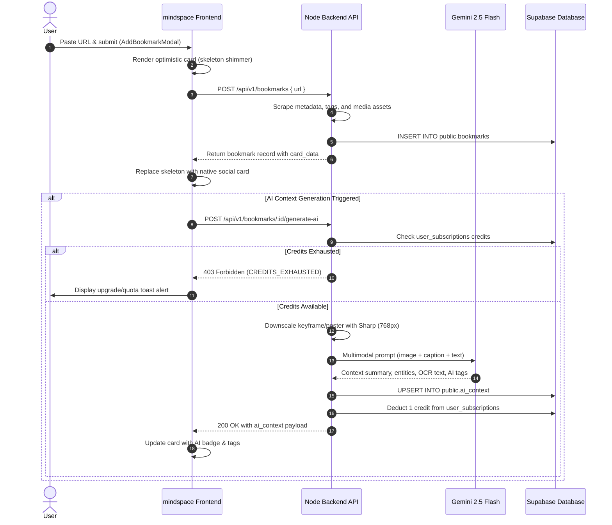
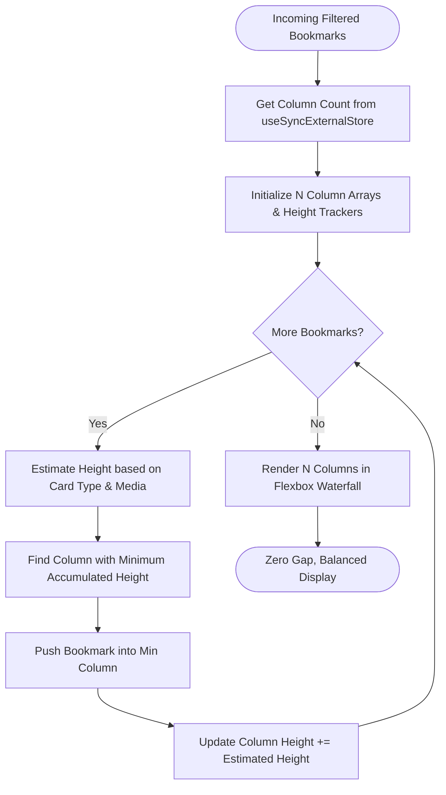

# Mindspace Frontend (`mindspace-frontend`)

A modern, responsive, high-performance web media and social bookmark curator built with **React 19**, **TypeScript**, **Vite 8**, **Tailwind CSS v4**, **Liquid Glass**, and **Supabase**.

Mindspace transforms URLs from major social networks (Twitter / X, Instagram, LinkedIn, Reddit, YouTube, Facebook) and arbitrary web pages into rich, platform-native interactive cards. Bookmarks are enhanced with automated metadata extraction, safe image caching and proxy fallbacks, and token-efficient **Multimodal Gemini AI** visual intelligence.

---

## Table of Contents

1. [Architecture & System Overview](#architecture--system-overview)
2. [Design System & Aesthetics](#design-system--aesthetics)
3. [What Has Been Done Until Now](#what-has-been-done-until-now)
   - [1. Authentication & Session Management](#1-authentication--session-management)
   - [2. Node Backend & Supabase Architecture](#2-node-backend--supabase-architecture)
   - [3. Automated Multimodal AI Pipeline & Credit Enforcement](#3-automated-multimodal-ai-pipeline--credit-enforcement)
   - [4. Platform-Native Social Cards UI Overhaul](#4-platform-native-social-cards-ui-overhaul)
   - [5. Waterfall Masonry Layout & 120 FPS Search](#5-waterfall-masonry-layout--120-fps-search)
   - [6. Media Reliability, Proxy Fallback & In-Memory Cache](#6-media-reliability-proxy-fallback--in-memory-cache)
   - [7. Codebase Optimization & Quality Auditing (Zero Bloat)](#7-codebase-optimization--quality-auditing-zero-bloat)
4. [Mermaid Architecture & Data Flow Diagrams](#mermaid-architecture--data-flow-diagrams)
   - [System Topology & Infrastructure](#system-topology--infrastructure)
   - [Bookmark Creation & Multimodal AI Sequence](#bookmark-creation--multimodal-ai-sequence)
   - [Waterfall Masonry Greedy Distribution Flow](#waterfall-masonry-greedy-distribution-flow)
5. [Component & Directory Structure](#component--directory-structure)
6. [API Client Specifications](#api-client-specifications)
7. [Environment Variables](#environment-variables)
8. [Getting Started & Verification](#getting-started--verification)

---

## Architecture & System Overview

Mindspace employs a decoupled, secure **client-service architecture**:

- **Frontend (`mindspace-frontend`)**:
  - **Core**: React 19 + TypeScript + Vite 8.
  - **Styling**: Tailwind CSS v4 with custom Vanilla CSS Design Tokens (`src/index.css`) featuring the *Sand Dune* palette, glassmorphism (`@samasante/liquid-glass`), and dark/light View Transitions.
  - **State & Rendering**: React 18/19 Concurrent primitives (`useDeferredValue`), `useSyncExternalStore` for resize tracking, memoized components (`React.memo`), callback stabilization (`useCallback`), and session-level in-memory media caching.
  - **Data Access**: Pure REST integration through a typed API client (`src/services/api.ts`) communicating with the Node.js backend. No direct database secrets or queries run on the client.
- **Backend Service (`mindspace-node-backend`)**:
  - **Platform Scrapers & Extractors**: Cheerio, Playwright, and social metadata parsers for Twitter, Instagram, LinkedIn, Reddit, YouTube, Facebook, and generic web articles.
  - **AI Visual Intelligence**: Google Gemini 2.5 Flash (`@google/genai`) for multimodal vision analysis, entity extraction, OCR transcription, and contextual tagging.
  - **Image Proxy**: Streaming reverse image proxy (`/api/v1/proxy-image?url=...`) resolving hotlink-blocked CDN assets (Meta, Reddit, Twitter).
  - **Database & Auth Integration**: Supabase PostgreSQL tables (`bookmarks`, `ai_context`, `user_subscriptions`, `user_settings`) protected by Row Level Security (RLS) and bearer token authentication.

---

## Design System & Aesthetics

Mindspace delivers a tactile, liquid-glass aesthetic inspired by modern macOS interfaces and warm desert sand dunes:

- **Liquid Glass Container**: Interactive refractions and specular highlights powered by `@samasante/liquid-glass`, rendering glassmorphic cards and floating HUD elements with backdrop blur filters.
- **Sand Dune Color Palette**:
  - Light Mode: Warm cream backgrounds (`#fbf8f3`, `#f5f0e6`), soft sand borders (`#e8decb`), crisp high-contrast headings (`#2d261e`), and terracotta accents (`#c06c46`).
  - Dark Mode: Deep obsidian tones (`#121110`, `#1a1816`), warm charcoal surfaces (`#24211e`), muted amber borders (`#38332c`), and glowing dune highlights (`#d97745`).
- **Animated View Transitions**: Full-page, circular ripple theme toggles using the native Web View Transitions API (`document.startViewTransition`) and `AnimatedThemeToggler.tsx`.
- **Micro-Interactions**: Smooth hover elevations, spring-based scale transitions, and responsive carousel navigation.

---

## What Has Been Done Until Now

### 1. Authentication & Session Management
- **Supabase Auth Integration (`src/App.tsx`, `src/components/AuthPage.tsx`, `src/lib/supabase.ts`)**:
  - Secure email/password authentication and sign-up with real-time field validation and error handling.
  - Session persistence and hydration on initial application load via `supabase.auth.getSession()`.
  - Live listener subscription (`supabase.auth.onAuthStateChange()`) synchronizing auth states across tabs and auto-refreshing JWTs.
  - Protected routing:
    - `/`: Interactive 3D/scrolling Landing Page (`LandingPage.tsx`) showcasing product features and dynamic navigation.
    - `/auth`: Minimalist glassmorphic authentication terminal.
    - `/my/app`: Authenticated curator dashboard; unauthorized visitors are redirected to `/auth`.

### 2. Node Backend & Supabase Architecture
- **Eliminated Client-Side DB Vulnerabilities**:
  - Frontend code is decoupled from direct Supabase database calls. All persistence, scraping, metadata extraction, and AI operations route through `src/services/api.ts` with the user's JWT bearer token.
- **Relational Supabase PostgreSQL Schema**:
  - `public.bookmarks`: Core table storing `id`, `user_id`, `url`, `title`, `description`, `image_url`, `card_type`, `card_data` (JSONB), and timestamps.
  - `public.ai_context`: Dedicated 1:1 relational table (`bookmark_id`, `user_id`, `context`, `ai_tags`, `visual_entities`, `ocr_text`, `created_at`) with `ON DELETE CASCADE`. Avoids bloat on primary queries.
  - `public.user_subscriptions`: Tracks user plan (`free` vs `pro`), monthly credit allocations, and usage counters.
  - `public.user_settings`: User preferences and interface configuration.
- **Row-Level Security (RLS)**:
  - All tables enforce tenant isolation using Supabase RLS policies tied to `auth.uid() = user_id`.

### 3. Automated Multimodal AI Pipeline & Credit Enforcement
- **Multimodal Visual Intelligence (Gemini 2.5 Flash)**:
  - Server-side ingestion of web page hero images, video posters, and keyframes.
  - Pre-processed with Sharp (downscaled to 768px single-tile) for minimal token overhead and sub-1.5s latency.
  - Synthesizes deep contextual summaries, detects salient visual entities, extracts embedded OCR text, and assigns categorizing AI tags.
- **Credit Quota & Tier Gating**:
  - Free users receive 5 AI context generation credits per month; Pro users receive unlimited or expanded allocations.
  - Frontend intercepts 403 `CREDITS_EXHAUSTED` responses via `CreditExhaustedError`, rendering upgrade toasts and disabling duplicate triggers.
- **Glassmorphic AI Context Modal (`AiContextModal.tsx`)**:
  - Displays generated summaries, interactive pill tags, detected visual entities, and raw OCR transcription with one-click clipboard copying.

### 4. Platform-Native Social Cards UI Overhaul
Every supported social network renders as an authentic, platform-native card rather than a generic box:

| Platform | Component | Features Implemented |
| :--- | :--- | :--- |
| **Twitter / X** | `TwitterCard.tsx` | Native typography, verified badges, author avatar, formatted tweet text, multi-image carousels, reply/repost/like/view metrics, and X branding. |
| **Instagram** | `InstagramCard.tsx` | Instagram profile header, multi-aspect-ratio image carousels with dot pagination, expandable caption parser, like and comment counters. |
| **LinkedIn** | `LinkedInCard.tsx` | Authentic multi-reaction badges (Like, Celebrate, Support, Insightful), author headline, multi-image collage grid with `+N` overflow badge, comments and reposts. |
| **Reddit** | `RedditCard.tsx` | Subreddit alien avatar, `r/community` name, author username, upvote/downvote action badges, comment count, self-text preview, and image/video embed display. |
| **YouTube** | `YouTubeCard.tsx` | Embedded video player / high-res thumbnail viewer, channel avatar, subscriber and view count formatters, and YouTube branding. |
| **Facebook** | `FacebookCard.tsx` | Facebook blue reaction badge, author avatar, post timestamp, likes/comments/shares counters, and multi-media support. |
| **Generic Web** | `GenericCard.tsx` | Universal fallback for blogs and articles: domain badge, Google S2 high-res favicon, snapshot preview, article title, and summary. |

### 5. Waterfall Masonry Layout & 120 FPS Search
- **True Greedy Waterfall Distribution (`src/templates/bookmarks.tsx`)**:
  - Eliminates awkward gaps and unbalanced columns caused by pure CSS column-count.
  - Uses an optimal greedy algorithm: each bookmark is assigned to the column with the least accumulated visual height.
  - Responsive column counts (`1` for mobile, `2` for tablet, `3` for laptop, `4` for desktop) dynamically monitored via `useSyncExternalStore`.
- **Concurrent React 19 Search**:
  - Search queries filtered via `useDeferredValue(rawSearchTerm)` to keep input typing at **120 FPS** without UI freezing.
  - Instant fuzzy matching across title, description, URL, domain, platform, and author.

### 6. Media Reliability, Proxy Fallback & In-Memory Cache
- **In-Memory Image Session Cache (`SafeImage.tsx`)**:
  - Global `Set` tracks loaded image URLs across mounts; subsequent views display immediately at `opacity-100` with zero layout shift (CLS).
- **Automated Proxy Fallback**:
  - Intercepts 403 Forbidden / CORS errors caused by anti-hotlinking CDN protections (Instagram/Meta CDNs, Reddit i.redd.it).
  - Automatically reroutes image requests through `/api/v1/proxy-image?url=...` without user intervention.
- **Strict URL Sanitization (`src/lib/utils.ts`)**:
  - Validates URLs and blocks dangerous schemes (`javascript:`, `vbscript:`, `data:`, `file:`).

### 7. Codebase Optimization & Quality Auditing (Zero Bloat)
- **Dead Code Eradication**:
  - Removed unreferenced legacy files: `SocialCardWrapper.tsx`, `BottomNavbar.tsx`, `GlassCursor.tsx`.
  - Cleaned up unused imports, dead variables, and legacy formatting helpers across all 30 source files.
- **Centralized Utilities (`src/lib/utils.ts`)**:
  - Unified number formatting (`formatNumber`), relative dates (`formatRelativeDate`), card type resolution (`resolveCardType`), and platform filtering (`matchesPlatform`).
- **Standardized Type Safety**:
  - Strongly typed all API payloads, card data structures, and bookmark models (`src/types/bookmark.ts`).
  - Zero `any` casts in core application paths.
- **Rollup Chunk Splitting (`vite.config.ts`)**:
  - Intelligent code-splitting separates heavy libraries into isolated vendor chunks (`vendor-three`, `vendor-glass`, `vendor-motion`, `vendor-icons`, `vendor-react`), reducing initial bundle load times.
- **Strict Verification**:
  - **0 ESLint errors** and **0 ESLint warnings**.
  - **0 TypeScript compile errors** (`tsc -b`).

---

## Mermaid Architecture & Data Flow Diagrams

### System Topology & Infrastructure

```mermaid
graph TB
    subgraph Client ["Client Layer (mindspace-frontend)"]
        UI[React 19 Dashboard & Social Cards]
        State[Waterfall Masonry & Deferred Search]
        Cache[SafeImage In-Memory Cache]
        APIClient[Typed REST Client (services/api.ts)]
    end

    subgraph Backend ["Service Layer (mindspace-node-backend)"]
        Router[Express API Gateway /api/v1]
        Scraper[Cheerio & Playwright Scrapers]
        ImgProxy[Streaming Reverse Image Proxy]
        Gemini[Google Gemini 2.5 Flash Vision API]
        Quota[Credit & Quota Engine]
    end

    subgraph SupabaseDB ["Persistence Layer (Supabase PostgreSQL)"]
        Auth[Supabase Auth / JWT]
        T_Bookmarks[(public.bookmarks)]
        T_AI[(public.ai_context)]
        T_Subs[(public.user_subscriptions)]
    end

    UI --> State
    UI --> Cache
    UI --> APIClient
    APIClient -- Bearer JWT --> Router
    Router --> Quota
    Router --> Scraper
    Router --> Gemini
    Router --> ImgProxy
    Router -- Service Role / RLS --> T_Bookmarks
    Router -- 1:1 Cascade --> T_AI
    Quota --> T_Subs
    Cache -. 403 Fallback .-> ImgProxy
```

### Bookmark Creation & Multimodal AI Sequence



### Waterfall Masonry Greedy Distribution Flow



---

## Component & Directory Structure

```
mindspace-frontend/
├── src/
│   ├── components/
│   │   ├── SocialCards/
│   │   │   ├── CarouselNavButtons.tsx   # Left/right carousel navigation arrows
│   │   │   ├── ExpandableText.tsx       # Smooth collapsible caption expander
│   │   │   ├── FacebookCard.tsx         # Platform-native Facebook post card
│   │   │   ├── GenericCard.tsx          # General website bookmark card with Google S2 favicon
│   │   │   ├── InstagramCard.tsx        # Platform-native Instagram post & reel card
│   │   │   ├── LinkedInCard.tsx         # Platform-native LinkedIn card with reaction badges
│   │   │   ├── RedditCard.tsx           # Platform-native Reddit post card with vote counters
│   │   │   ├── SafeImage.tsx            # Cached image loader with auto proxy fallback
│   │   │   ├── SocialCardIcons.tsx      # SVG icon assets for all platforms & actions
│   │   │   ├── TwitterCard.tsx          # Platform-native Twitter / X card
│   │   │   └── YouTubeCard.tsx          # Platform-native YouTube player/thumbnail card
│   │   ├── ui/
│   │   │   ├── AnimatedThemeToggler.tsx # View-transition dark/light theme switcher
│   │   │   ├── ContainerScroll.tsx      # Smooth 3D scroll container for landing showcases
│   │   │   ├── DashboardWireframe.tsx   # Visual wireframe preview of curator dashboard
│   │   │   ├── FeatureBento.tsx         # Bento-grid feature highlights
│   │   │   ├── InteractiveStory.tsx     # Step-by-step interactive product narrative
│   │   │   └── ScreenSkeleton.tsx       # Shimmering skeleton loader for initial data load
│   │   ├── AddBookmarkModal.tsx         # Modal dialog for submitting new URLs
│   │   ├── AiContextModal.tsx           # Multimodal AI Context, Tags, Entities & OCR modal
│   │   ├── AuthPage.tsx                 # Supabase authentication terminal
│   │   ├── BookmarkCard.tsx             # Card dispatcher routing to specific social card
│   │   ├── DeleteConfirmModal.tsx       # Confirmation dialog for bookmark removal
│   │   └── LandingPage.tsx              # Public interactive landing page
│   ├── Layout/
│   │   └── DashboardLayout.tsx          # Shell: header, search, filters, toast notifications, API orchestration
│   ├── lib/
│   │   ├── supabase.ts                  # Supabase client initialization
│   │   └── utils.ts                     # Single source of truth for formatters, sanitizers, and card resolvers
│   ├── services/
│   │   └── api.ts                       # Typed REST client with error classes for mindspace-node-backend
│   ├── templates/
│   │   ├── bookmarks.tsx                # Dynamic greedy waterfall masonry grid & platform tabs
│   │   └── nav.tsx                      # Top search bar and user profile controls
│   ├── types/
│   │   └── bookmark.ts                  # TypeScript interfaces for bookmarks, AI context, and card data
│   ├── App.tsx                          # Root router & auth session lifecycle provider
│   ├── index.css                        # Tailwind CSS v4 directives & Sand Dune design tokens
│   └── main.tsx                         # Vite application entry point
├── package.json
└── vite.config.ts                       # Vite configuration with chunk splitting & Tailwind v4
```

---

## API Client Specifications

All network interactions pass through `src/services/api.ts`:

- `fetchBookmarks()`: Retrieves all bookmarks for the authenticated user, joined with AI context.
- `createBookmark({ url })`: Initiates URL scraping, metadata extraction, and storage.
- `triggerGenerateAi(bookmarkId)`: Requests server-side Gemini 2.5 Flash multimodal vision analysis. Throws `CreditExhaustedError` on 403 quota exhaustion.
- `deleteBookmark(bookmarkId)`: Removes bookmark and cascades deletion to `ai_context`.
- `updateBookmarkMetadata(bookmarkId, data)`: Edits title, description, or custom notes.
- `getUserPlan()`: Retrieves current subscription tier (`free` / `pro`) and remaining AI credits.

---

## Environment Variables

Create a `.env` file in `mindspace-frontend/`:

```env
# Supabase Configuration
VITE_SUPABASE_URL=https://your-project.supabase.co
VITE_SUPABASE_ANON_KEY=your-anon-key-here

# mindspace Node Backend URL
VITE_API_URL=http://localhost:3000/api/v1
```

---

## Getting Started & Verification

### Prerequisites
- Node.js (v18 or higher)
- npm or pnpm

### Installation
```bash
npm install
```

### Local Development
```bash
npm run dev
```
Starts the local development server with Vite HMR at `http://localhost:5173`.

### Code Quality Verification
Run the ESLint suite to verify zero lint errors:
```bash
npx eslint .
```

### Production Build
Compile TypeScript and generate optimized production bundles:
```bash
npm run build
```

### Production Preview
Test the production build locally:
```bash
npm run preview
```
